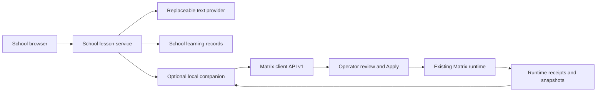

# School of the Ancients

A provisional text-first School implementation: historical mentor, prepared lesson, interactive visual, and durable conversation. This candidate preserves useful ideas from the older beta without coupling the learning session to a live audio model.

**School and [Matrix Loading Operator](https://github.com/School-of-the-Ancients/matrix-loading-operator) are independent products.** School owns learning and mentor conversation; Matrix owns scenes, content and observed runtime actions. An optional versioned connector joins them.

This repository is an implementation candidate for [roadmap #13](https://github.com/School-of-the-Ancients/school-of-the-ancients-roadmap/issues/13), not an automatic migration of beta/v2 or their records. See the [organization plan](https://github.com/School-of-the-Ancients/school-of-the-ancients-roadmap) and [Kanban](https://github.com/orgs/School-of-the-Ancients/projects/1).

## Try the first lesson

Requires **Node.js 24 or newer**. From this repository:

```powershell
npm.cmd ci
npm.cmd start
```

Open **http://127.0.0.1:8792/**. Choose Galileo and begin **A small change. A bigger question.** Ask a question, make a prediction, change the block, explain the result, and reflect. The default **Authored demo** uses clearly labeled scripted replies and makes no model calls.

Your transcript, exact lesson version, recorded experiment and progress save on this PC. Reload or return to the academy to resume. **Export** downloads a JSON learning record. Completion records participation, not assessed mastery. Nothing needs a headset, microphone, Unity, or Matrix connection.

For optional read-aloud, choose **Listen to latest reply** beneath the conversation. It uses a local English device voice when the browser provides one; **Stop audio** ends playback. Read the [mentor audio guide](Docs/Mentor-Speech.md) for availability and controls. Typed conversation remains available throughout.

For optional input, choose **Dictate draft** in a supported browser. Correct the recognized text before sending. The browser may process microphone audio remotely; School does not store raw audio. See [speech input](Docs/Speech-Input.md).

### Use a real mentor response

The optional Codex adapter uses an existing local **ChatGPT sign-in**. Configure a native Codex executable and a model available to that account, then start the service:

```powershell
$env:SCHOOL_PROVIDER='codex-cli'
$env:SCHOOL_CODEX_EXE=(Get-Command codex.exe).Source
$env:SCHOOL_CODEX_MODEL='<your available model>'
npm.cmd start
```

Stop an already running School process with Ctrl+C before restarting it. If `codex.exe` is not on PATH, set its absolute native executable path. Run `codex login` in your own terminal if sign-in is needed. The app shows configured, checked and last-turn status separately; it never calls a model just to report health.

Live mode sends the selected lesson, recent conversation and recorded browser experiment to Codex. API keys and room captures are not needed. The adapter requests a read-only, ephemeral, text-only turn with tools disabled and rejects tool events or invalid output. See [provider configuration and validation](Docs/Development.md).

## What works in this candidate

| Feature | Current behavior |
| --- | --- |
| Historical guide | One educational interpretation of Galileo; no invented historical testimony |
| Prepared lesson | Explanation → example/prediction → guided experiment → explanation → reflection |
| Conversation | Scripted demonstration or real Codex text responses; questions keep the current step |
| Interactive visual | Replaceable deterministic scale view, data table or hidden visual; recorded dimensions and volume remain available |
| Records | Atomic local saves, resume, export, cancellation, interrupted-turn recovery and request deduplication |
| Matrix integration | Optional pairing, reviewed block placement and scale/reset presets, with saved runtime evidence |
| Mentor read-aloud | Manual playback and stop for the latest saved reply, using a browser-reported local English voice |
| Voice input and headset teaching | Optional browser dictation fills an editable draft; headset teaching remains unavailable |

Browser dimensions are simulated units. The illustration is not a Unity scene, measured room, or physical observation. No hosted deployment, multi-user authentication, durable Matrix event replay, or headset acceptance is claimed.

## Two products, clear ownership



School owns mentors, teaching and learning records. Matrix owns scene/content execution and its observations. Open **Matrix connection** inside a lesson to pair with an updated local Matrix service. Requesting a block creates a proposal; approve it in Matrix's Operator before it runs. School records the reported placement without advancing the lesson or treating it as a physical measurement. Neither product imports the other's internal application model.

- [User walkthrough](Docs/User-Guide.md)
- [Optional mentor read-aloud](Docs/Mentor-Speech.md)
- [Optional speech input](Docs/Speech-Input.md)
- [Replaceable lesson visual](Docs/Visual-Adapter.md)
- [Optional Matrix connection](Docs/Matrix-Bridge.md)
- [Scale the lesson block in Matrix](Docs/Matrix-Scale-Lesson.md)
- [Prepared exhibit packages and readiness](Docs/Prepared-Exhibits.md)
- [Development, configuration and tests](Docs/Development.md)
- [Architecture and module boundaries](Docs/Architecture.md)
- [Beta/v2 reuse audit](Docs/Reuse-Audit.md)
- [Validation evidence and remaining acceptance](Docs/Validation.md)
- [Asset provenance](Docs/Provenance.md)

## Check changes

```powershell
npm.cmd test
npm.cmd run typecheck
```

Ordinary tests use deterministic fixtures. The opt-in Matrix test needs a checkout containing its new v1 API; the opt-in live mentor smoke check consumes a real model turn. Instructions are in [Development](Docs/Development.md). The roadmap and its acceptance issues remain open until the full intended behavior is reviewed.
